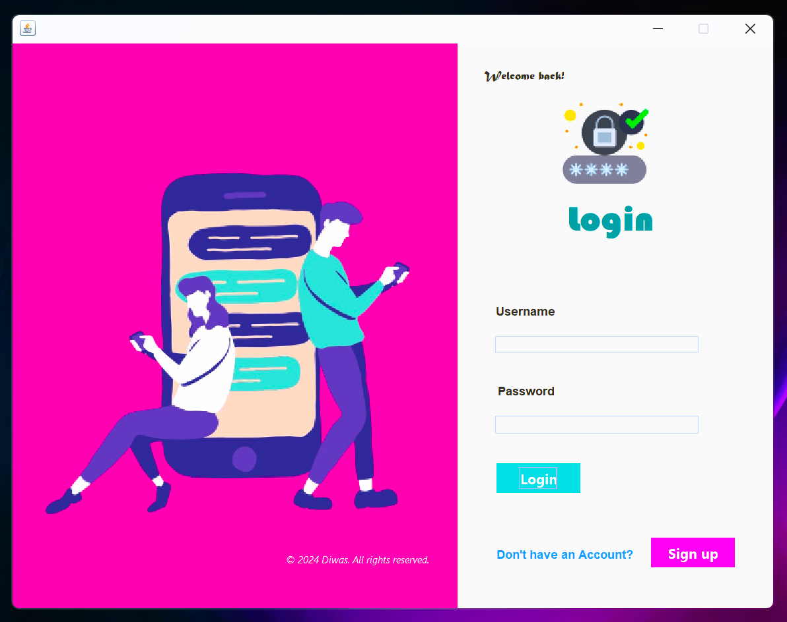
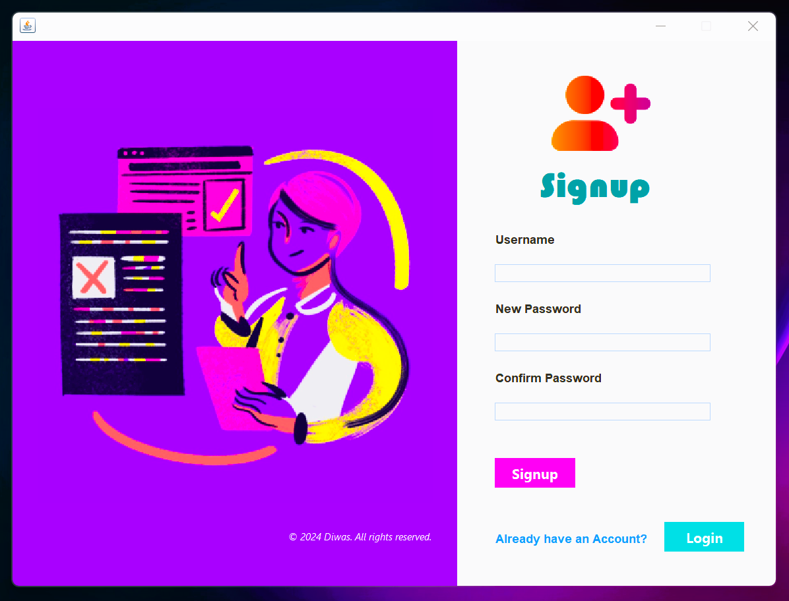

# UserAuthentication

This repository contains a simple Java Swing application that demonstrates basic user authentication functionalities, including user registration and login. The project is built using Java and MySQL.

## Features

- **User Registration**: Users can create new accounts by providing a username and password.
- **User Login**: Registered users can log in using their credentials.
- **Dashboard**: After successful login, users are redirected to a dashboard interface.

## Project Structure

The project contains the following key files:

- **Login.java**: Handles user login, including form validation and authentication against stored credentials in the database.
- **Signup.java**: Manages the user registration process, including checking for password confirmation and saving new users to the database.
- **Dashboard.java**: Displays a welcome message after successful login.

## Screenshots

### Login


### Signup


### Dashboard


## Usage

1. Clone the repository:
   ```bash
    git clone https://github.com/diwasbk/UserAuthentication.git
2. The application uses MySQL for storing user credentials. Ensure you have MySQL installed and running before setting up the project.
## Author

- [Diwas Bk](https://github.com/diwasbk)